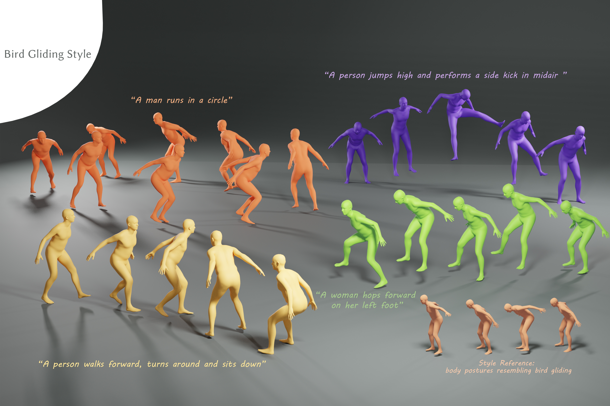
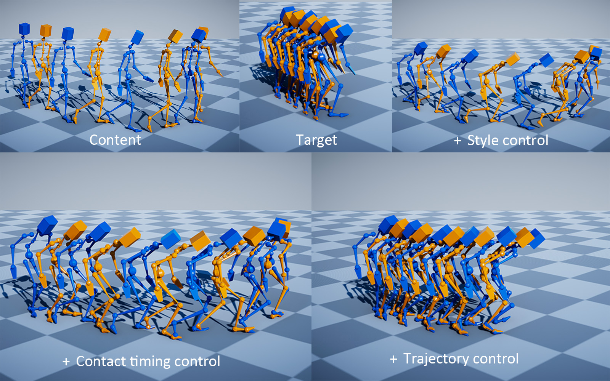
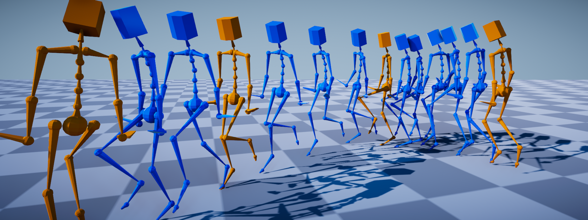

I am Linjun Wu, a second-year Ph.D candidate at the State Key Lab of CAD&CG, Zhejiang University, advised by Prof. [Xiaogang Jin](http://www.cad.zju.edu.cn/home/jin). I received my bachelor’s degree in artificial intelligence from Zhejiang University in 2023.

**Research Interest**: Character Animation.

**Address:** Zijingang Campus of Zhejiang University, 866 Yuhangtang Rd, Hangzhou, China.

**Contact:** 12321232@zju.edu.cn; Woollen9@163.com

Publications
======

  

    
  

  

    
<strong>Semantically Consistent Text-to-Motion with Unsupervised Styles</strong> 
      <strong>Linjun Wu</strong>, <a href="https://yuyujunjun.github.io/">Xiangjun Tang</a>, Jingyuan Cong, <a href="http://drhewang.com/">He Wang</a>, Bo Hu, Xu Gong, Songnan Li, Yuchen Liao, <a href="https://onethousandwu.com/">Yiqian Wu</a>, Chen Liu, <a href="http://www.cad.zju.edu.cn/home/jin/">Xiaogang Jin</a>
       SIGGRAPH '25 Conference Proceedings 
      <a>Paper</a> | <a href="https://fivezerojun.github.io/stylization.github.io/">Project Page</a> | <a>Code</a> | <a href="https://www.youtube.com/watch?v=ZYCjhcN-T5s">Video</a>
    

  

  

    
  

  

    
<strong>Decoupling Contact for Fine-Grained Motion Style Transfer</strong> 
      <a href="https://yuyujunjun.github.io/">Xiangjun Tang</a>, <strong>Linjun Wu</strong>, <a href="http://drhewang.com/">He Wang</a>, <a href="https://onethousandwu.com/">Yiqian Wu</a>, Bo Hu, Songnan Li, Xu Gong, Yuchen Liao, Qilong Kou, <a href="http://www.cad.zju.edu.cn/home/jin/">Xiaogang Jin</a>
       SIGGRAPH ASIA '24 Conference Proceedings 
      <a href="http://www.cad.zju.edu.cn/home/jin/SigA20241/High_quality_Controllable_Motion_Style_Transfer.pdf">Paper</a> | <a href="http://www.cad.zju.edu.cn/home/jin/SigA20241/Decoupling_Contact.htm">Project Page</a>
    

  

  

    
  

  

    
<strong>RSMT: Real-time Stylized Motion Transition for Characters</strong> 
      <a href="https://yuyujunjun.github.io/">Xiangjun Tang</a>, <strong>Linjun Wu</strong>, <a href="http://drhewang.com/">He Wang</a>, Bo Hu, Xu Gong, Yuchen Liao, Songnan Li, Qilong Kou, <a href="http://www.cad.zju.edu.cn/home/jin/">Xiaogang Jin</a>
       SIGGRAPH '23 Conference Proceedings 
      <a href="https://yuyujunjun.github.io/files/2023_Siggraph_RSMT.pdf">Paper</a> | <a href="https://yuyujunjun.github.io/publications/Siggraph2023_RSMT/">Project Page</a> | <a href="https://github.com/yuyujunjun/RSMT-Realtime-Stylized-Motion-Transition">Code</a>
    

  

